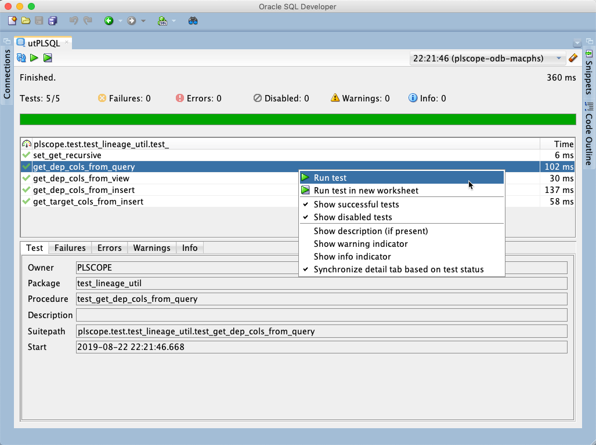
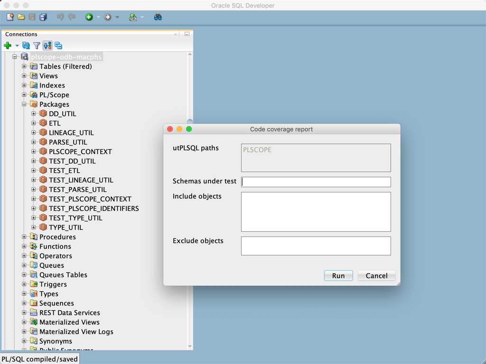
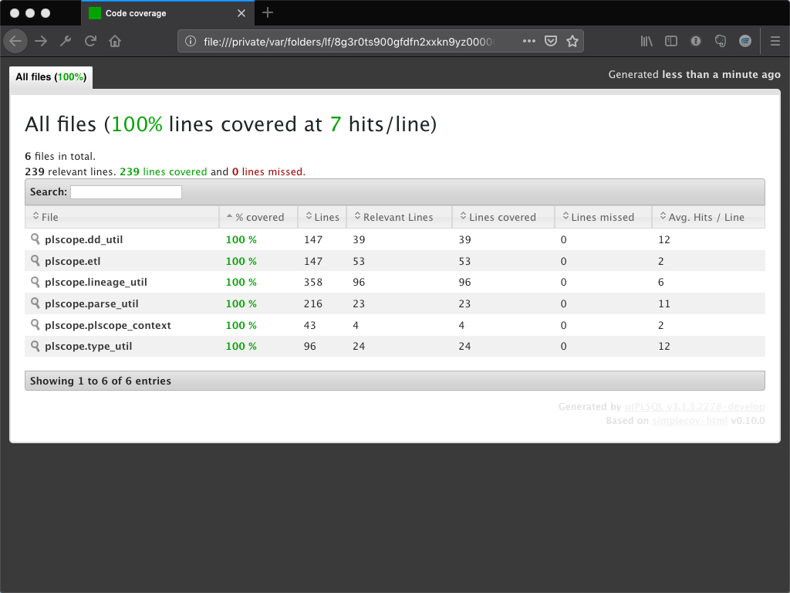
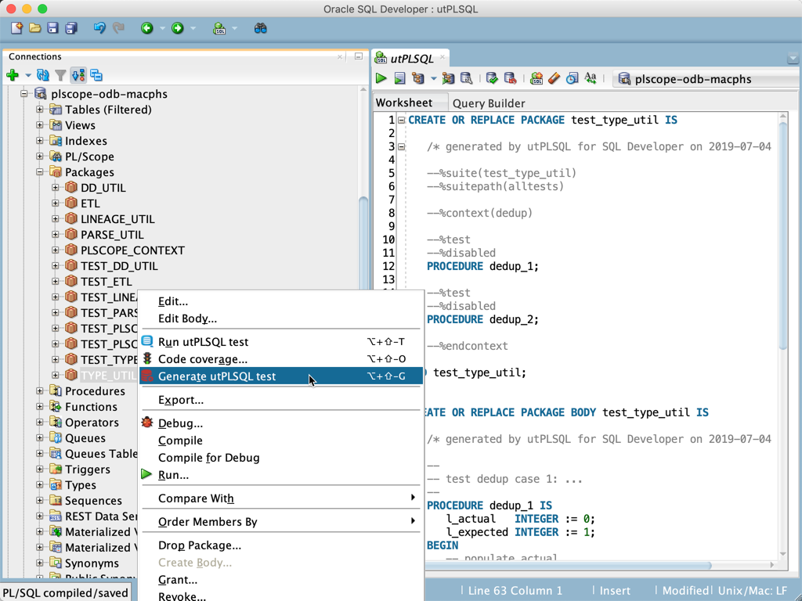
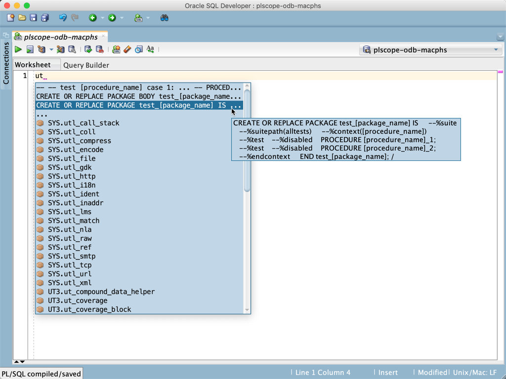
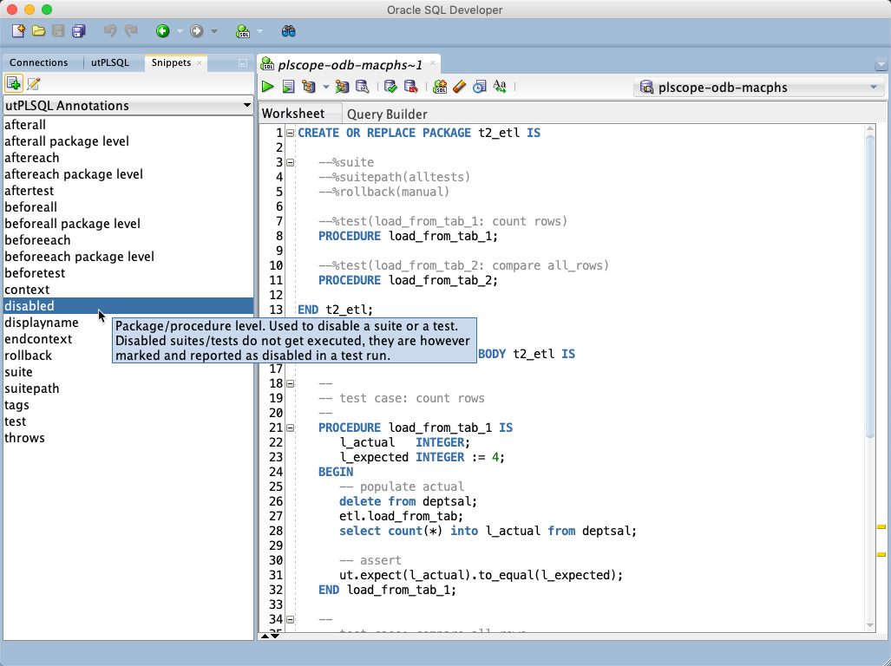
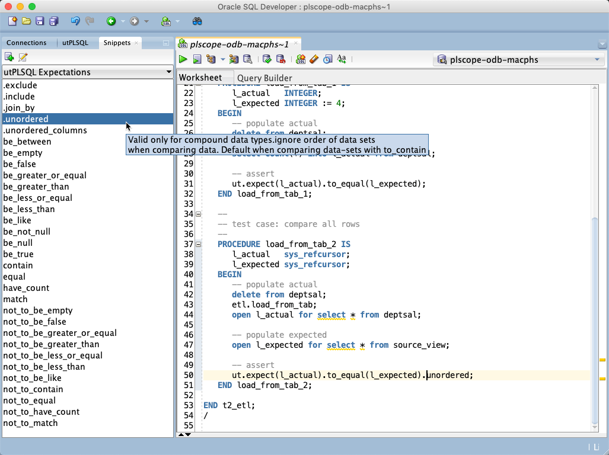
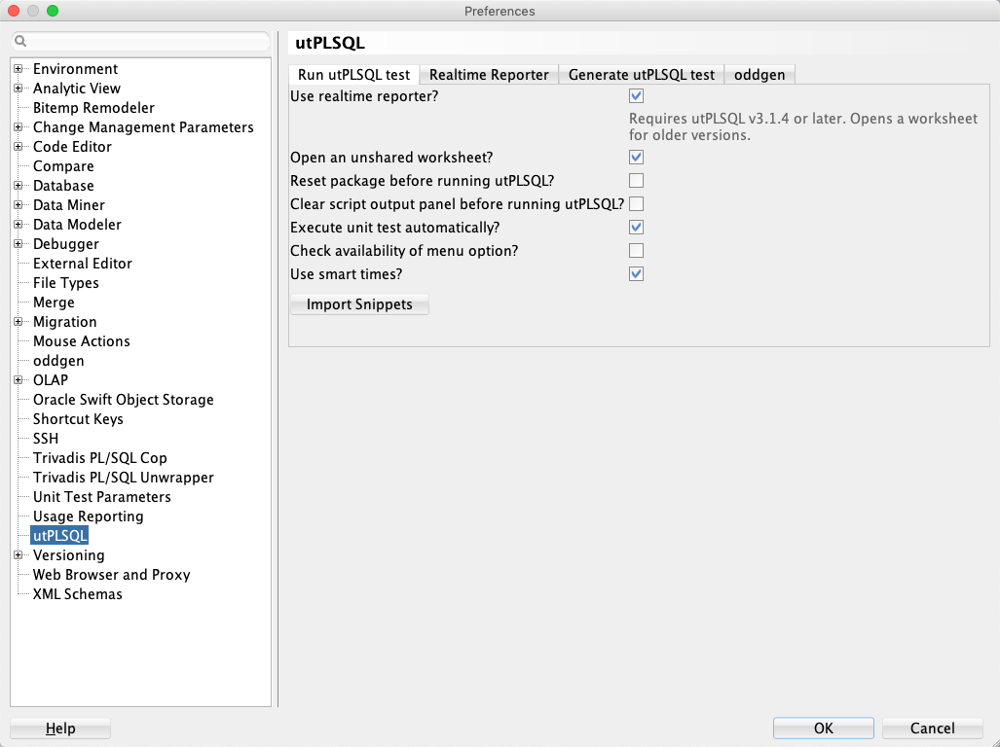
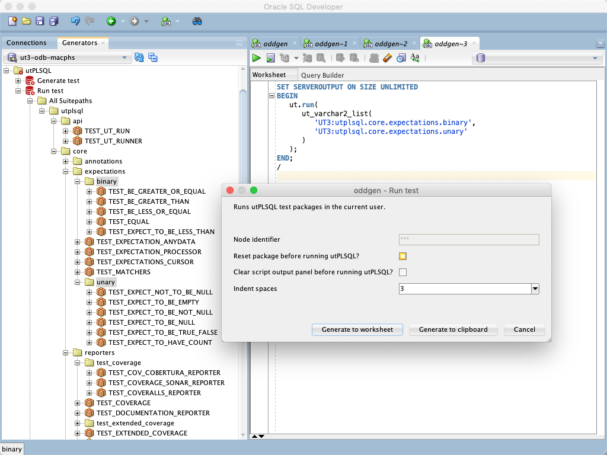
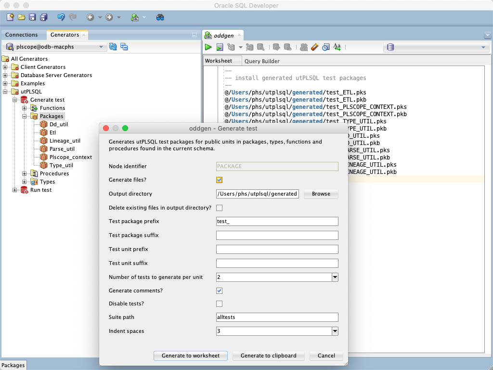

# utPLSQL for SQL Developer

## Introduction

utPLSQL for SQL Developer extends Oracle's SQL Developer to 

* run existing utPLSQL unit tests
* run utPLSQL code coverage reports 
* generate new utPLSQL unit tests (skeletons)
* provide utPLSQL annotations and expectations as snippets

### Run utPLSQL test

In the Connections window, select a connection or one or more packages or package procedures to run utPLSQL tests. Or you can run utPLSQL tests directly from the PL/SQL editor. The test procedures are determined according to the cursor position in the PL/SQL editor.



### Code coverage...

In the Connections window, select a connection or one or more packages for a code coverage report.

In the dialog you can set some parameters. If you run code coverage for a few chosen packages or from the PL/SQL editor the objects to be included are determined according the object dependencies in the Oracle data dictionary. 



Press `Run` to produce the code coverage process in the background. You may minimize or close the dialog. To abort the process, press `Cancel`. 

The HTML report is shown in your default browser.



### Generate utPLSQL test

#### Based on existing code

Select a package, type, function or procedure to build a utPLSQL test package skeleton. The generated package compiles and executes, but still needs some rework.



#### From scratch

1. Press the button `Create code templates` in the preferences
2. Type `ut_` in the Worksheet or a PL/SQL editor and press `Ctrl-Space` to get the list of a utPLSQL code templates
3. Press `Return` to paste a code template at the current cursor position



### Snippets

Import utPLSQL snippets for annotations and expectations via the the `Import Snippets` button of the utPLSQL [preferences dialog](#preferences).

Insert the snippets by drag & drop into your code.

#### Annotations

Annotations are used in the package specification for various test configurations.



#### Expectations

Expectations are used in the package body to compare actual with expected results.



### Preferences

Set your preferences to change the behaviour of utPLSQL within SQL Developer.



### oddgen integration

utPLSQL for SQL Developer implements the [OddgenGenerator2 interface](https://www.oddgen.org/java-interface/) to

* run existing utPLSQL test suitepaths and test suites
* bulk generate new utPLSQL unit tests into dedicated files

The use of [oddgen for SQL Developer](https://www.oddgen.org/) is optional. 

#### Run utPLSQL test

utPLSQL can run tests based on suitepaths and suites. The next screenshot shows the generated run command for two selected suitepaths.



#### Generate utPLSQL test

Use oddgen to generate utPLSQL test package skeletons. When generating to files, a file for each package specification and package body is created.



## Releases

Binary releases are published [here](https://github.com/utPLSQL/utPLSQL-SQLDeveloper/releases).

## Installation

### From file

1. Start SQL Developer

2. Select ```Check for Updates…``` in the help menu.

3. Use the ```Install From Local File``` option to install the previously downloaded ```utplsql_for_SQLDev_*.zip``` file.

### Via Update Center

1. Start SQL Developer

2. Select ```Check for Updates…``` in the help menu.

3. Press ```Add…``` to register the ```salvis.com``` update site ```http://update.salvis.com/```.

4. Use the ```Search Update Center``` option and select the ```salvis.com``` update center to install the lastest version of ```utPLSQL for SQL Developer```.

## Issues
Please file your bug reports, enhancement requests, questions and other support requests within [Github's issue tracker](https://help.github.com/articles/about-issues/).

* [Questions](https://github.com/utPLSQL/utPLSQL-SQLDeveloper/issues?q=is%3Aissue+label%3Aquestion)
* [Open enhancements](https://github.com/utPLSQL/utPLSQL-SQLDeveloper/issues?q=is%3Aopen+is%3Aissue+label%3Aenhancement)
* [Open bugs](https://github.com/utPLSQL/utPLSQL-SQLDeveloper/issues?q=is%3Aopen+is%3Aissue+label%3Abug)
* [Submit new issue](https://github.com/utPLSQL/utPLSQL-SQLDeveloper/issues/new)

## How to Contribute

1. Describe your idea by [submitting an issue](https://github.com/utPLSQL/utPLSQL-SQLDeveloper/issues/new)
2. [Fork the utPLSQL-SQLDeveloper respository](https://github.com/utPLSQL/utPLSQL-SQLDeveloper/fork)
3. [Create a branch](https://help.github.com/articles/creating-and-deleting-branches-within-your-repository/), commit and publish your changes and enhancements
4. [Create a pull request](https://help.github.com/articles/creating-a-pull-request/)

## How to Build

1. [Download](http://www.oracle.com/technetwork/developer-tools/sql-developer/downloads/index.html) and install SQL Developer 19.1.0
2. [Download](https://maven.apache.org/download.cgi) and install Apache Maven 3.5.4
3. [Download](https://git-scm.com/downloads) and install a git command line client
4. Clone the utPLSQL-SQLDeveloper repository
5. Open a terminal window in the utPLSQL-SQLDeveloper root folder and type

		cd sqldev

6. Run maven build by the following command

		mvn -Dsqldev.basedir=/Applications/SQLDeveloper19.1.0.app/Contents/Resources/sqldeveloper -DskipTests=true clean package

	Amend the parameter sqldev.basedir to match the path of your SQL Developer installation. This folder is used to reference Oracle jar files which are not available in public Maven repositories
7. The resulting file ```utplsql_for_SQLDev_x.x.x-SNAPSHOT.zip``` in the ```target``` directory can be installed within SQL Developer

## License

utPLSQL for SQL Developer is licensed under the Apache License, Version 2.0. You may obtain a copy of the License at <http://www.apache.org/licenses/LICENSE-2.0>.
